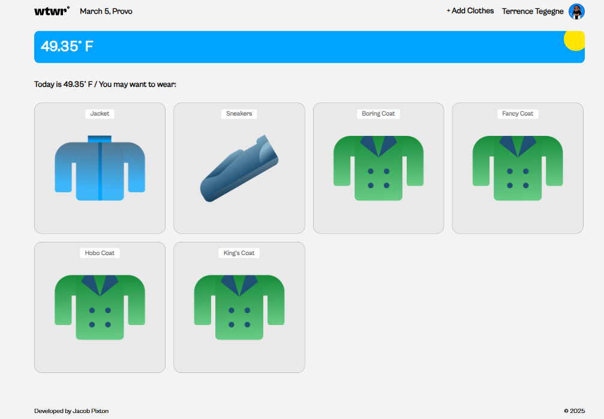
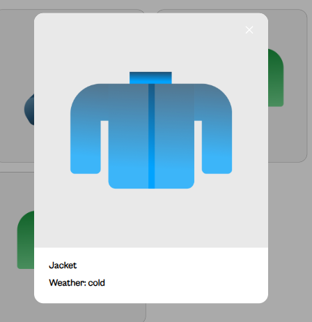
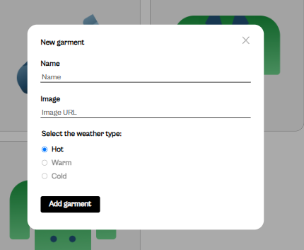

# 🌦️ What to Wear - Weather-Based Outfit Suggestions

## 🏗️ Project Overview

**What to Wear** is a **React and Vite-based web application** that provides clothing recommendations based on the local temperature. By integrating **real-time weather data**, this project demonstrates dynamic UI updates, API consumption, and component-based development using React.

This project is my **first attempt** at building a React + Vite application, utilizing my existing knowledge of **HTML, JavaScript, and CSS** to create a seamless and interactive user experience.

---

## 🚀 Features

✅ **Real-time Weather Fetching** – Retrieves temperature data using an API.  
✅ **Smart Outfit Recommendations** – Suggests clothing based on the current temperature.  
✅ **Fast & Optimized Performance** – Built with **Vite**, ensuring a smooth development and production experience.  
✅ **Responsive Design** – Works across mobile and desktop devices.  
✅ **Modular React Components** – Clean and reusable components for scalability.

---

## 🛠️ Tech Stack

- **Frontend:** React, JavaScript (ES6+)
- **Styling:** CSS
- **API Integration:** OpenWeather API
- **State Management:** React Hooks (`useState`, `useEffect`)
- **Build Tool:** Vite

---

## 🎯 Learning Objectives

This project serves as a foundational **React learning experience**, helping me build proficiency in:

- **Component-based architecture** in React
- **Fetching and handling API data** using `fetch()`
- **State management with React Hooks**
- **Conditional rendering and user interaction**
- **Styling React components efficiently**
- **Optimizing React performance with Vite**

---

## 📸 Demo Screenshots

---

## 🚀 Live Demo

🌍 **Check out the deployed version of the project here:**  
🔗 [**What to Wear App**](https://ImYellingTibbers.github.io/se_project_react/)
